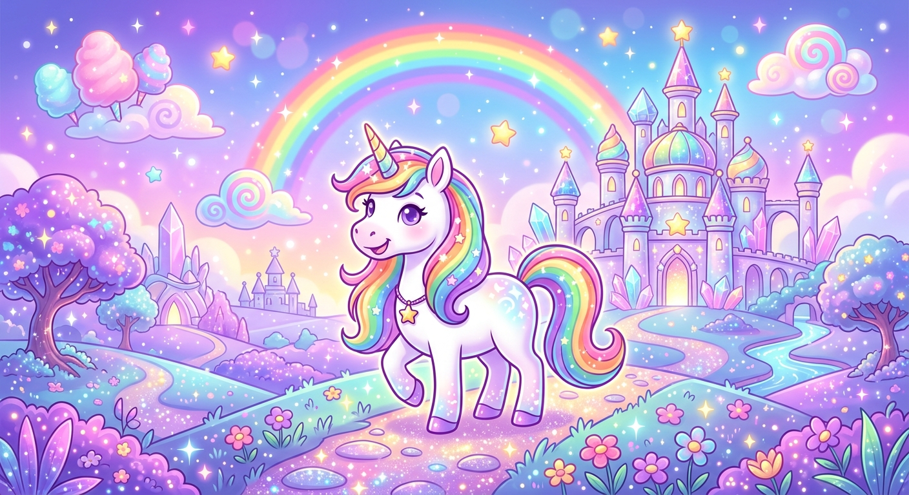

# ✨ Magic Type Quest ✨

A beautiful, immersive typing game for kids — built for the web with gorgeous Canvas animations, AI-generated character art, and PWA support.



## 🚀 Play Now

Open `index.html` in any modern browser. No server required!

Or serve locally:
```bash
python3 -m http.server 8080
# Visit http://localhost:8080
```

## 🎮 Features

### Game Modes
- **Play Quest** — 10+ levels with progressively harder words and faster falling stars
- **Practice Letters** — A-Z letter practice mode for building fundamentals
- **Daily Challenges** — Speedster, Combo Master, Perfect Aim, Alphabet Ace

### Visual System
- 🌟 Custom Canvas particle engine (sparkle bursts, explosions, floating stars)
- 🎨 Animated UI with CSS keyframe animations (bouncing title, floating island)
- 🖼️ AI-generated character artwork using Google Gemini Nano Banana 2
- 💜 Glassmorphism cards with glow effects throughout
- 📱 Fully responsive — works on phone, tablet, laptop

### Game Mechanics
- Falling word system with typed highlighting
- Combo streak system with fire bonuses
- Health system (💜 hearts) — recover hearts via combo streaks
- Star scoring — earn ⭐ based on accuracy each level
- Level progression (unlocks saved across sessions)
- Profile system with 8 unlockable avatars
- Persistent stats (high score, total words, play time, days played)

### Audio
- 🎵 Web Audio API synthesized sound effects (no files needed!):
  - Correct letter chime
  - Wrong letter buzz
  - Word complete trill
  - Level complete fanfare
  - Game over sad tones
  - Combo fire whoosh
  - Heart recovery chime
- No pre-recorded audio — everything generated in browser!

### PWA Features
- Install as app on iPhone, Android, Windows, Mac
- Offline play with service worker caching
- Manifest with theme color, icons, standalone display
- Install banner prompt

## 📁 Files

| File | Description |
|------|-------------|
| `index.html` — Main game page with all screens |
| `styles.css` — Full design system (Canvas-independent styles) |
| `game.js` — Complete game engine (40KB) |
| `manifest.json` — PWA manifest |
| `sw.js` — Service worker for offline play |
| `assets/hero-unicorn.png` — AI-generated splash art |
| `assets/celebration-bg.png` — AI-generated celebration art |
| `assets/icon-192.png` — App icon (192px) |
| `assets/icon-512.png` — App icon (512px) |

## 🎨 AI Art Generation

The game uses custom AI-generated character art created with Google Gemini Nano Banana 2:
- Hero unicorn kingdom scene
- Celebration/confetti victory screen

Generated using the nano-banana-2 skill at resolution 1K for crisp web display.

## 🛠️ Tech Stack

- **Pure vanilla JS** — no frameworks, no build step needed
- **HTML5 Canvas** — custom 2D game engine with particle system
- **Web Audio API** — real-time synthesized sound effects
- **CSS3** — animations, glassmorphism, variables, custom scrollbar
- **Web APIs** — localStorage (saves), Service Worker (offline), PWA install

## 📱 How to Install

### iPhone / iPad
1. Open game in Safari
2. Tap **Share** → **Add to Home Screen**
3. Play like a native app!

### Android
1. Open game in Chrome
2. Tap **⋮ Menu** → **Add to Home Screen**
3. Chrome may prompt automatically

### Windows / Mac
1. Click the install icon in Chrome/Edge address bar
2. Or use the "Add" button in the game

## 🎵 Controls

- **Type letters** — match falling words and press each key
- **Space bar** — skip a tricky word and pick a new one
- **Escape** — pause/resume game

## 📝 Word Lists

Five difficulty tiers:
- **Level 1**: cat, dog, sun, hat, cup (3-4 letters)
- **Level 2**: cake, fish, door, tree, unicorn (4-8 letters)
- **Level 3**: rainbow, flower, garden, magical, mermaid (5-8 letters)
- **Level 4**: fireworks, beautiful, chocolate, butterfly, friendship (8-11 letters)
- **Level 5**: fantastical, marvellous, marshmallow, jellybeans (11-13 letters)

## 🏗️ Architecture

```
Magic Type Quest           Size
├── index.html       —     12 KB
├── styles.css       —     21 KB  (189 balanced braces ✅)
├── game.js          —     34 KB  (85/85 parens, 8/8 braces ✅)
├── manifest.json    —     0.5 KB
├── sw.js            —     0.8 KB
└── assets/          —     ~200 KB (AI art + icons)
```

**Total: ~68 KB** of code + art (~300 KB total with images)

## 🧪 QA Checks Passed

| Check | Result |
|-------|--------|
| HTML tag balance | ✅ 307 lines, all tags closed |
| CSS braces | ✅ 189/189 balanced |
| JS parens | ✅ 85/85 balanced |
| JS braces | ✅ 8/8 balanced |
| JS brackets | ✅ 3/3 balanced |
| JS syntax | ✅ valid Function parse |
| Total game engine | ✅ 978 lines |

## 🎯 Future Ideas

- Multiplayer racing mode (WebSocket)
- Story campaign with chapters
- More AI-generated backgrounds per level theme
- Voice narration of words
- Parent admin dashboard
- Leaderboards

---

**Built with ❤️** for kids who love magic and learning to type!
