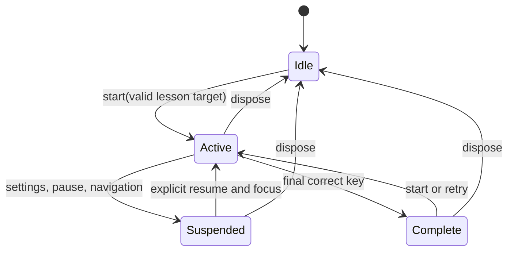

# Shared typing input contract (#161)

`src/v2/input/TypingInputService.ts` is the only v2 adapter from keyboard/touch events to encounter attempts. The DOM shell owns its focusable typing surface and controlled touch field. Phaser scenes subscribe to encounter results later; they do not install keyboard listeners. The service emits events but stores no transcript or learner progress. #162 owns durable data, and #166 will connect attempts to the mastery engine and habitat state machine.

## Lifecycle and focus

`start` checks every character against `getAllowedKeys(lessonId)`, including Shift for capitals and shifted punctuation. It rejects an empty sequence, missing mission, or unintroduced key before collecting input. Only a focused practice surface processes physical printable keys. Browser shortcuts using Ctrl, Meta, or Alt, Tab, navigation keys, modifier-only keys, dead keys, IME composition, and keys typed into DOM controls pass through unscored. Escape on the focused surface requests pause. Settings, dialogs, navigation, and scene teardown suspend input; resume explicitly focuses the surface. The service removes its listeners on disposal.

## Event and capability contract

`keyAttempt` is followed by `correctKey` or `incorrectKey`. The attempt includes expected/received key, Shift expectation/use, timestamp, lesson and mission IDs, sequence position, source, and `scorable`. Correct attempts then emit `sequenceProgress`, followed by `sequenceComplete` at the end. `retryRequested`, `pauseRequested`, and `inputCapabilityChanged` cover control and input mode changes. The visual state exposes the next target and last correct/incorrect press. The service never updates mastery itself. A later encounter coordinator must pass only `scorable` physical attempts to evidence aggregation.

The optional touch field opens through the explicit **Use touch keyboard** control. Its events use `source: touch` and `scorable: false`; the shell explains that touch practice does not record physical-key mastery. Paste and multi-character insertion are ignored. This fallback helps learners participate without falsely proving finger placement. Physical keyboard capability is detected on the first printable attempt, never inferred from screen size. Unsupported keyboard layouts and IME text remain unscored until curriculum and layout support is specified.

## Feedback and accessibility

The shell exposes the objective, target, finger guidance, sequence progress, correction, and completion in DOM. QWERTY finger guidance uses the opposite hand for Shift. Correct keys update the visible progress immediately; errors preserve the target and use calm retry text. Live announcements throttle repeated errors and intermediate target changes while always announcing completion and the third consecutive error's extra guidance. The practice area has a visible focus ring and browser Tab navigation remains intact. Touch input is a visible, labelled control only while enabled.

## Verification

`npm run validate:input` tests event order and metadata, curriculum gates, Shift, shortcuts, focus, IME, touch/paste, retries, announcements, and cleanup. `npm run test:e2e:v2` covers actual browser focus, physical F/J input, dialog suspension, touch fallback, and axe checks. This is a narrow Meadow input preview; the full encounter and mastery wiring belong to #166/#167.
