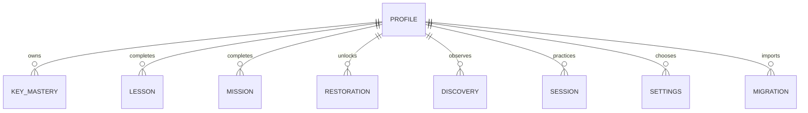

# Local-first learner progress (#162)

Nature Quest v2 uses native IndexedDB through `ProgressRepository`. `SCHEMA_VERSION = 2` and `IMPORT_VERSION = 1` are explicit. No dependency, account, cloud client, or raw typing transcript is needed. The v1 `bloomtype-*` keys remain owned by v1 and are never written or deleted by this repository. The v2 active learner pointer is the only localStorage preference (`naturequest:v2:active-profile`); IndexedDB is canonical.

Every store has an `id` key. Learner-owned rows include `learnerId`; mission, stage, and species IDs use stable content IDs with a learner prefix. Session IDs use a stable encounter ID. Schema upgrades add missing stores without clearing existing rows. `commitEncounter` validates the curriculum and content reference, reads current aggregates, applies evidence with the mastery engine, and saves evidence, mission, restoration, discovery, and one compact session summary in one transaction. The encounter ID makes repeated commits no-ops. Unique mission/stage/species IDs prevent duplicate rewards on a later encounter. #166 will provide completed mission results; the current F/J preview persists only a practice summary and physical evidence.

## Copy/import

The importer reads `bloomtype-profile` and `bloomtype_profile_*` snapshots. It deliberately excludes `bloomtype-class-*` rosters. `previewLegacy` clamps malformed counts, removes invalid completed levels, limits the alias, and uses #158's conservative mapping: historical completion introduces keys, qualifying measured keys reach at most `familiar`, and no v2 lesson is completed. It never copies v1 UUID, class code, stars, email, or raw text. A `migrations` row records source key, source/import version, local learner ID, and timestamp. Reimporting the same source returns the existing profile. Resetting that learner also removes its marker, allowing an explicit new import later. The original v1 value remains byte-for-byte unchanged.

Example preview fixture: a v1 `Scout` profile with completed level 1 and F `13 correct / 1 wrong` yields F `familiar`, J with `3 correct / 1 wrong` yields `learning`, zero completed v2 lessons, and no biome unlock. Malformed JSON yields a `Player` profile with an empty mastery map and a warning. The browser tests exercise both fixtures.

The checked-in [sample export](evidence/progress-export-sample.json) uses fictional local identifiers and one aggregate F attempt. The [denied-storage screenshot](evidence/persistence-storage-unavailable.webp) records the recovery path.

## Validation and recovery

Reads validate each row. Invalid learner rows are isolated from selectors/export and returned as `problems`; no read silently deletes them. A missing or corrupt profile produces a typed `ProgressStorageError`. Settings offers **Repair progress labels** for valid evidence while retaining invalid rows for diagnosis. Errors show the shell's child-safe recovery view. The export includes schema, local alias/id, mastery aggregates, completed lessons/missions, restoration/discoveries, compact session summaries, and safe settings. It has no transcript, class IDs, or secret. Settings offers export, reset one v2 learner, and delete all v2 local data behind semantic confirmation dialogs. V1 deletion is not exposed. `CLOUD_SYNC_OFF` is the empty approved-sync port; no Supabase client enters the v2 bundle.

## Verification and limitations

`npm run validate:persistence` runs native-browser schema upgrade, import, duplicate, malformed, atomic rollback, reload, browser process restart, export, reset, denied-storage, and corruption tests. `npm run test:e2e:v2` covers the shell's save/reload and loaded-offline practice journeys plus accessibility. A fresh browser context starts with a clean database. IndexedDB can be unavailable in restrictive browser modes; the shell reports it and remains playable for unsaved practice. Multiple tabs require a future coordination policy before production cutover; a version change closes the old connection. #176 owns offline return of the preview route and current biome assets. The preview has no completed v2 mission yet, so habitat rewards are not awarded by F/J practice.
